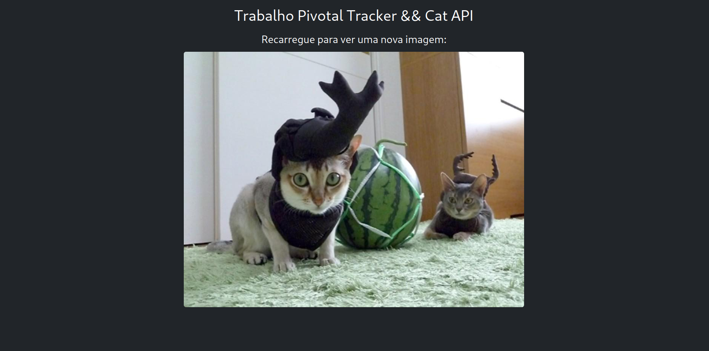
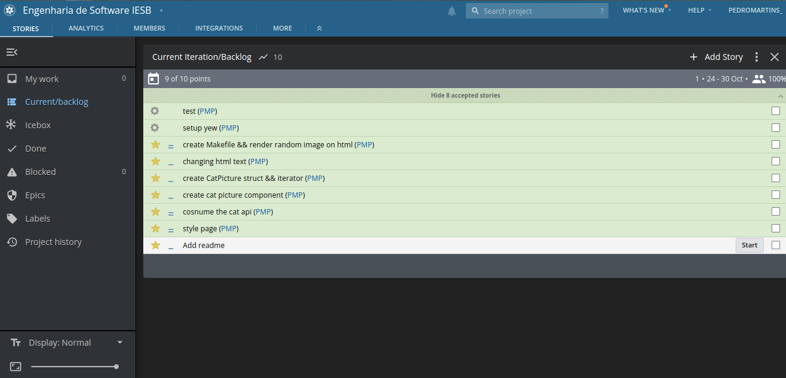

# Trabalho Pivotal Tracking

## Instruções:

Criar um frontend que consuma "**The Cat API**" e exiba uma imagem aleatória de gato a cada recarregamento.
A criação do frontend deve ser documentada e monitorada através da ferramenta **Pivotal Tracker**. 

## Implementação:

Foi criado um frontend escrito em Rust, utilizando o framework Yew. Através da dependência Trunk o projeto pode ser compilado para WebAssembly (Wasm) e executado no browser. 

Bootstrap também foi utilizado para criar uma estilização básica.

## Dependências e Execução:

Para executar o projeto é necessário ter instalada a linguagem de programação **Rust**, o bundler **Trunk**, assim como adicionar WebAssembly como um alvo de compilação para o Rustc.

Entretanto, caso você esteja em um sistema Linux e tenha curl instalado, criei um shellscript que instala todas as dependências automáticamente, basta executar

```
$ ./install_deps.sh
```

Similarmente para executar basta executar o Makefile:

```
$ make run
```

## Screenshots:



